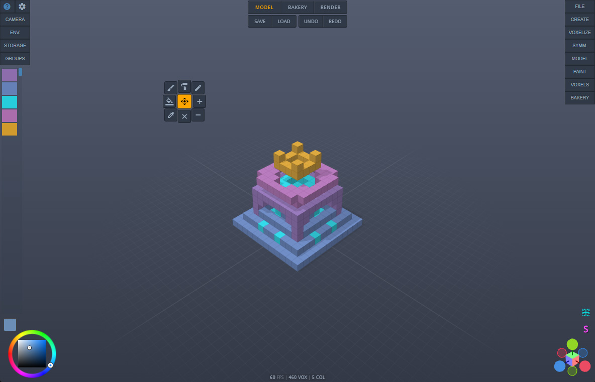

# Voxel Builder

</img>

### **Voxel-based 3D modeling application**

Version 4.0.4 RC 2023<br>
Babylon.js 6.10.0

[Try Now](https://nimadez.github.io/voxel-builder)<br>
[Documentation](https://github.com/nimadez/voxel-builder/wiki)

## Features

**File I/O**
- Save and load JSON format as VBX ([wiki page](https://github.com/nimadez/voxel-builder/wiki/VBX-Format))
- Load from MagicaVoxel
- Export to GLB, render to PNG
- Quick save and load, undo/redo
- Load HDR images and textures
- Load 3D models and images for voxelization
- Support file drag-n-drop *(VBX, VOX, OBJ, GLB, HDR, PNG, JPG, SVG)*
- [Blender importer script](https://github.com/nimadez/voxel-builder/blob/main/scripts/blender-importer.py) for VBX files

**Model and Paint**
- Generators: terrain, cube, plane, sphere, ellipsoid, random, isometric
- OBJ and GLB voxelization
- Image voxelization *(JPG, PNG, SVG)*
- Interactive modeling toolsets
- Drawing and painting in freeform and box-shape
- Symmetric drawing and painting, symmetrize and mirror
- Transformable workplane to draw anywhere in the space

**Mesh Bakery**
- Bake voxel particles, optimize mesh before export
- Clone, instance, merge, and transform bakes
- Setup PBR material and textures
- Ready for 3D printing

**Rendering**
- Basic PBR rendering, HDRI lighting, and post-processing
- WASD controls on desktop, joystick controls on touchscreen

**WebSocket Client**
- Send and receive voxel data
- See [wiki page](https://github.com/nimadez/voxel-builder/wiki/WebSocket-Client)

**More**
- Clean handcrafted user-interface
- Minimum dependency, portable, online and offline
- Ad-free, no miners and trackers, no logging

## Supported Browsers
- Electron *(recommended)*
- Google Chrome for desktop
- Google Chrome for mobile devices
<br><sub>* *PWA A2HS-ready (add to home screen)*</sub>
> Touch pen or Wacom tablet recommended for best experience

## Known Issues
```
■ Maximum 64K voxels (64000 or 40x40x40)
Higher values can have the following problems:
- Picking issue (GPU)
- SPS rebuild delay (CPU)
- Browser storage (unable to save/load/undo/redo)
- Baking takes forever

Of course, the number of voxels is unlimited, there are
no restrictions, so you can use this program in the future
with more powerful computers.

■ GLB failed to import multiple meshes for voxelization
Multiple meshes need to have the same properties,
or they won't merge, the only solution is to merge meshes
before exporting to GLB.
```

## FAQ
```
■ Will this project remain open-source?
Yes, remain open-source and ad-free

■ How to merge vertices after export to GLB?
1- Open exported GLB file in Blender
2- Go to "Modeling" tab and choose vertex selection mode
3- Select all vertices (Ctrl + A)
4- Mesh > Clean Up > Merge by Distance

■ How to run Blender importer script?
1- Save project to VBX file
2- Open Blender and go to "Scripting" tab
3- Click "Open" and select "blender-importer.py"
4- Run the script and select a VBX file
```

## History
```
4.0.0 -> release candidate
3.8.0 -> advancing to the next level (bakery)
3.6.0 -> major code rewrite
3.4.0 -> new features and uix overhaul
3.0.0 -> SPS particles to build the world
0.0.0 -> I wrote a playground for learning Babylon.js
```

###### v3.0.0 *(BJS 4)* to v4.0.0 *(BJS 6)*<br>


## License
Code released under the [MIT license](https://github.com/nimadez/voxel-builder/blob/main/LICENSE).

## Credits
<a href="https://www.babylonjs.com/"></img></a>

- [Babylon.js](https://www.babylonjs.com/)
- [Three.js](https://threejs.org/) *(asset-viewer, vi²xel, texture and hdri samples)*
- [MagicaVoxel](https://ephtracy.github.io/)
- [Electron](https://www.electronjs.org/)
- [Google Material Icons](https://github.com/google/material-design-icons)
- [Blender](https://blender.org/)
- [KhronosGroup glTF-Sample-Models](https://github.com/KhronosGroup/glTF-Sample-Models)
- [KhronosGroup glTF-Sample-Environments](https://github.com/KhronosGroup/glTF-Sample-Environments)
- [Sketchfab](https://sketchfab.com/) *(MagicaVoxel free samples)*
- [vengi](https://mgerhardy.github.io/vengi/) *(VBX format is supported by vengi)*

###### Available in [Babylon.js community demos](https://www.babylonjs.com/community/)
