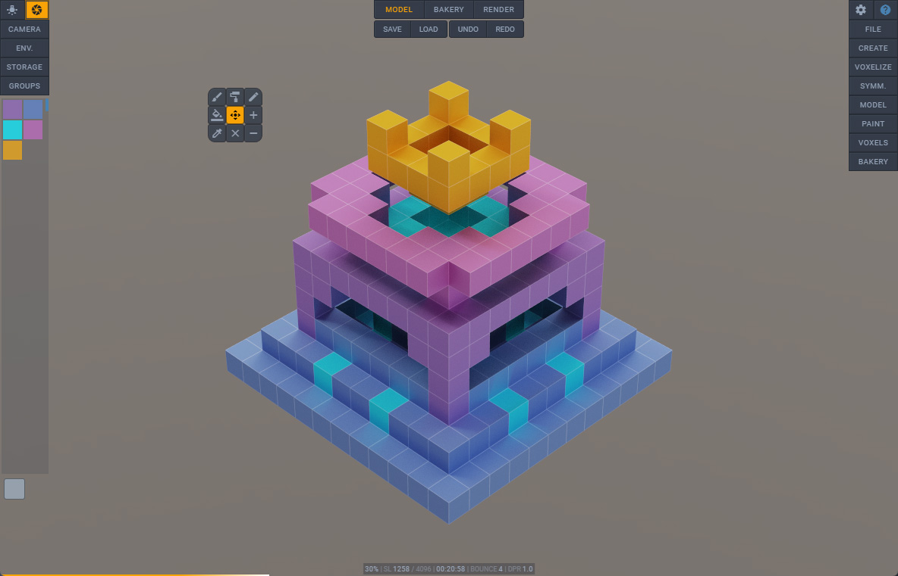

# Voxel Builder




**Voxel-based 3D modeling application**

Version 4.1.0 Beta 2023<br>
Babylon.js 6.26.0 ```main engine```<br>
Three.js r158

[Try Now](https://nimadez.github.io/voxel-builder)<br>
[Documentation](https://github.com/nimadez/voxel-builder/wiki)<br>
[Changelog](https://github.com/nimadez/voxel-builder/blob/main/CHANGELOG.md)

## Features

**File I/O**
- Save and load VBX [wiki](https://github.com/nimadez/voxel-builder/wiki/VBX-Format)
- Import MagicaVoxel VOX
- Export to GLB/GLTF/OBJ/STL
- Screenshot 4x to PNG
- Quick save and load, undo/redo
- Load HDR images and textures
- Load 3D models and images for voxelization
- Support file drag and drop<br>*(VBX, VOX, OBJ, GLB, HDR, PNG, JPG, SVG)*
- [Blender importer script](https://github.com/nimadez/voxel-builder/blob/main/scripts/blender-importer.py) for VBX files

**Model and Paint**
- Model generators *(terrain, cube, isometric...)*
- 3D model voxelization [wiki](https://github.com/nimadez/voxel-builder/wiki/Voxelization)
- Image voxelization [wiki](https://github.com/nimadez/voxel-builder/wiki/Voxelization)
- Interactive modeling toolsets
- Drawing and painting in freeform and box-shape
- Symmetric drawing and painting, symmetrize and mirror
- Transformable workplane to draw anywhere in the space

**Mesh Bakery**
- Bake voxel particles, optimize mesh before export
- Clone, merge, and transform bakes
- Setup PBR material and textures

**Rendering**
- Real-time GPU path tracing [wiki](https://github.com/nimadez/voxel-builder/wiki/Real-Time-GPU-Path-Tracing)
- Basic PBR rendering, HDRI lighting, and post-processing
- Sandbox WASD controls on desktop, joystick controls on touchscreen

**Extensibility**
- ES modules [wiki](https://github.com/nimadez/voxel-builder/wiki/Modules)
- WebSocket client [wiki](https://github.com/nimadez/voxel-builder/wiki/WebSocket-Client)

**More**
- External applications [wiki](https://github.com/nimadez/voxel-builder/wiki/External-Apps)
- Minimum dependency, portable, online and offline
- Ad-free, no miners and trackers, no logging

## Supported Browsers
- Electron *(recommended)*
- Google Chrome for desktop
- Google Chrome for tablet devices
<br><sub>* *PWA A2HS-ready (add to home screen)*</sub>
> - Touch pen or Wacom tablet recommended for best experience
> - Install the webapp to start fullscreen in landscape orientation
> - Voxel Builder is not optimized for small screens

## Known Issues
```
■ Maximum 64K voxels (64000 or 40x40x40)
Higher values can have the following problems:
- Picking issue (GPU)
- SPS rebuild delay (CPU)
- Local storage, unable to save/load/undo/redo
- Baking takes forever

Of course, the number of voxels is unlimited, there are
no restrictions, so you can use this program in the future
with more powerful computers.

■ GLB failed to import multiple meshes for voxelization
Multiple meshes need to have the same properties,
or they won't merge, the only solution is to merge meshes
before exporting to GLB.

■ Pathtracing is not supported on mobile devices
See comments @src/modules/pathtracer/app.js

■ Pathtracer does not support multi-material
See comments @src/modules/pathtracer/app.js
```

## FAQ
```
■ How to merge vertices after export to GLB?
1- Open exported GLB file in Blender
2- Go to "Modeling" tab and choose vertex selection mode
3- Select all vertices (Ctrl + A)
4- Mesh > Clean Up > Merge by Distance

■ How to run Blender importer script?
1- Save project to VBX file
2- Open Blender and go to "Scripting" tab
3- Click "Open" and select "blender-importer.py"
4- Run the script and select a VBX file
```

## History
```
↑ Real-time GPU path tracing
↑ Introducing ES modules
↑ Stable beta release
↑ Advancing to the next level (bakery)
↑ Major code rewrite (functions to classes)
↑ Features and uix overhaul
↑ New SPS particles to build the world
↑ I wrote a playground for learning Babylon.js
```

Latest:<br>


Version 3.0.0 *(BJS 4)* to 4.0.0 *(BJS 6)*<br>


## License
Code released under the [MIT license](https://github.com/nimadez/voxel-builder/blob/main/LICENSE).

## Credits
<a href="https://www.babylonjs.com/"></img></a>

- [Babylon.js](https://www.babylonjs.com/)
- [Three.js](https://threejs.org/)
- [Three-mesh-bvh](https://github.com/gkjohnson/three-mesh-bvh)
- [MagicaVoxel](https://ephtracy.github.io/)
- [Electron](https://www.electronjs.org/)
- [Google Material Icons](https://github.com/google/material-design-icons)
- [Blender](https://blender.org/)
- [Sketchfab](https://sketchfab.com/)
- [vengi](https://mgerhardy.github.io/vengi/)
- [KhronosGroup glTF-Sample-Models](https://github.com/KhronosGroup/glTF-Sample-Models)
- [KhronosGroup glTF-Sample-Environments](https://github.com/KhronosGroup/glTF-Sample-Environments)
- [Shadertoy](https://www.shadertoy.com/)

Thanks to friends whose knowledge has helped the progress of this project:
- [Allen Hastings](https://www.linkedin.com/in/allenhastings)
- [Erich Loftis](https://github.com/erichlof)
- [Eric Heitz](https://eheitzresearch.wordpress.com/772-2/)
- [Evan Wallace](https://github.com/evanw)
- [Garrett Johnson](https://github.com/gkjohnson)
- [Inigo Quilez](https://www.iquilezles.org/)
- [knightcrawler25](https://github.com/knightcrawler25)
- [Mr.doob](https://mrdoob.com/)

###### Available in [Babylon.js community demos](https://www.babylonjs.com/community/)
